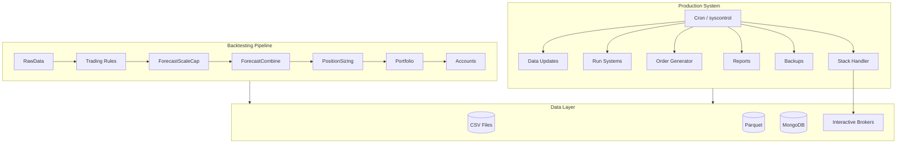

# pysystemtrade Documentation

**Systematic futures trading in Python** -- Rob Carver's open-source framework for backtesting and live trading systematic futures strategies.

| | |
|---|---|
| **Author** | Robert Carver |
| **Version** | 1.8.2 |
| **Python** | 3.13 |
| **License** | GPLv3 |
| **Broker** | Interactive Brokers (via ib-insync) |
| **Data backends** | Parquet, MongoDB, Arctic, CSV |

## Key Features

- **Backtesting framework** -- Multi-stage pipeline (rawdata, rules, forecast scaling, forecast combining, position sizing, portfolio) with caching and configurable parameters
- **Live trading** -- Production system with automated daily price updates, strategy order generation, execution via IB, and roll management
- **Position management** -- Three-layer order stack (instrument, contract, broker) with locking, fill tracking, and partial execution support
- **Risk management** -- Risk overlay system, position buffering, vol targeting, and correlation-aware portfolio construction
- **Roll management** -- Full futures roll lifecycle with multiple states (No_Roll, Passive, Force, Force_Outright, Roll_Adjusted, Close, No_Open)
- **Reporting** -- Automated P&L, risk, slippage, cost, liquidity, reconciliation, and status reports
- **Quantitative tooling** -- Estimators for correlations, vol, forecast scalars; optimisers (handcrafting, mean-variance); portfolio risk calculation

## Books and References

- [Systematic Trading](https://www.systematicmoney.org/systematic-trading) -- Rob Carver's first book covering the methodology
- [Leveraged Trading](https://www.systematicmoney.org/leveraged-trading) -- Simplified approach for smaller accounts
- [Advanced Futures Trading Strategies](https://www.systematicmoney.org/advanced-futures-trading-strategies) -- Deep dive into futures strategy design
- [Official pysystemtrade GitHub](https://github.com/robcarver17/pysystemtrade)
- [Rob Carver's Blog](https://qoppac.blogspot.com/)

## Quick Start

Run a minimal backtest using the built-in CSV data and example system -- no API keys, no database, no broker required:

```python
"""pysystemtrade Quick Start -- backtest with CSV data and provided rules."""
from systems.provided.futures_chapter15.basesystem import futures_system

# Create a complete system with default config and CSV data
# Uses ewmac trend-following + carry rules on 6 futures markets
system = futures_system()

# Get a raw forecast for Eurodollar (SOFR) using the ewmac2_8 rule
forecast = system.rules.get_raw_forecast("SOFR", "ewmac2_8")
print(forecast.tail())

# Get the combined forecast (all rules weighted together)
combined = system.combForecast.get_combined_forecast("SOFR")
print(combined.tail())

# Get the final position (after vol targeting and portfolio sizing)
position = system.portfolio.get_notional_position("SOFR")
print(position.tail())

# Full backtest P&L (this takes a few seconds)
account = system.accounts.portfolio()
print(account.stats())
```

This uses the `futures_chapter15` configuration which trades SOFR, US10, EUROSTX, V2X, MXP, and CORN with ewmac trend-following and carry rules. Data ships with the repo in `src/data/futures/`.

For a simpler two-rule system:

```python
from systems.provided.example.simplesystem import simplesystem

system = simplesystem()
# Trades SOFR, US10, CORN, SP500 with ewmac8 and ewmac32
print(system.accounts.portfolio().stats())
```

## Architecture Overview



## Module Summary

| Module | Description | Key Classes |
|--------|-------------|-------------|
| `systems` | Backtesting framework with stage pipeline | `System`, `SystemStage`, `RawData`, `Rules`, `ForecastScaleCap`, `ForecastCombine`, `PositionSizing`, `Portfolio` |
| `sysdata` | Data access layer with pluggable backends | `dataBlob`, `simData`, CSV/Parquet/Arctic/Mongo data classes |
| `sysbrokers` | Broker integration (Interactive Brokers) | `connectionIB`, IB data and execution classes |
| `sysexecution` | Order execution and management | `Order`, `orderStackData`, `stackHandler`, execution algos |
| `syscontrol` | Process management and scheduling | `processToRun`, timer functions, process monitoring |
| `sysquant` | Quantitative analysis and optimisation | Correlation/vol estimators, portfolio optimisers |
| `sysobjects` | Core data objects | `futuresContract`, `rollCycle`, `RollState`, positions, fills |
| `sysproduction` | Production system management | Data update runners, reporting, interactive tools |
| `syscore` | Shared utilities | Date utils, pandas helpers, caching, file operations |
| `syslogdiag` | Logging and diagnostics | Email alerts, log entries, process monitoring |
| `syslogging` | Structured logging | YAML-configured logging, adapters, filters |
| `sysinit` | Data initialisation and seeding | CSV-to-DB transfers, IB price seeding, roll calendar building |
| `data` | Static data files | Instrument configs, CSV price data, roll parameters, FX rates |

## Documentation Index

| Document | Description |
|----------|-------------|
| [Architecture](architecture.md) | System architecture, module breakdown, data flow, and dependency diagrams |
| [Workflows](workflow.md) | Backtesting pipeline, forecast generation, execution, roll management, daily production cycle |
| [State Management](state-management.md) | Order stack states, position tracking, roll state machine, process control |
| [Development](development.md) | Development setup, project structure, adding instruments, custom rules, testing |

## Upstream Documentation

The following upstream documents are maintained in this same `docs/` directory:

- [Introduction](introduction.md) -- Getting started guide
- [Installation](installation.md) -- Installation instructions
- [Backtesting](backtesting.md) -- Detailed backtesting documentation
- [Data](data.md) -- Data handling guide
- [Instruments](instruments.md) -- Instrument configuration
- [Production](production.md) -- Production deployment guide
- [Interactive Brokers](IB.md) -- IB-specific setup
