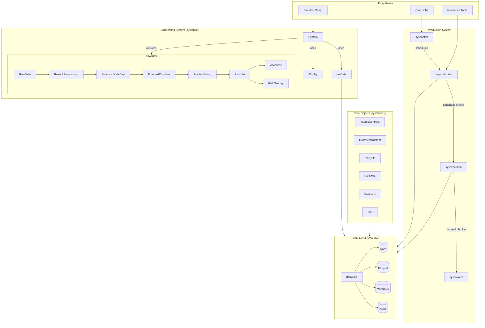
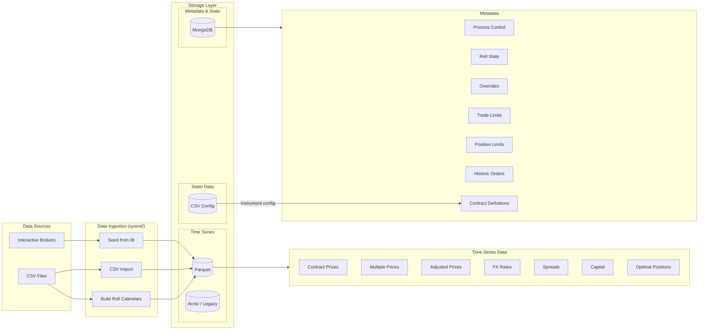
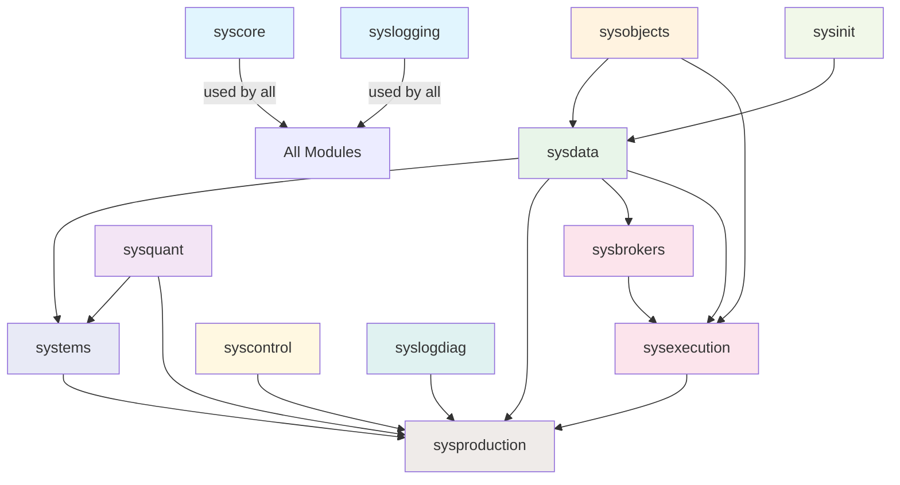

# Architecture

## System Architecture

pysystemtrade has two primary modes of operation: **backtesting** (simulation) and **production** (live trading). Both share the same data layer and core objects, but use different entry points and process orchestration.

## Trading Paradigm & Key Features

| Feature | Support | Details |
|---------|---------|---------|
| Backtesting Approach | Both | Vector-based stage pipeline (forecast, position sizing, portfolio) with cached calculations; event-driven production system for live order generation |
| Live Trading | Yes | Full production system with cron-scheduled processes, order stack execution, and Interactive Brokers integration |
| Paper Trading | No | No dedicated paper trading mode; backtesting with CSV/Parquet data serves as the simulation environment |
| Multi-Asset | Yes | Futures across all major asset classes (equity indices, bonds, commodities, FX, metals, energies, agriculturals); 100+ instruments supported |
| Data Feeds | Interactive Brokers, CSV, Parquet | IB for live/historical prices and FX; CSV for static config and seed data; Parquet as primary production storage; Arctic (legacy) |
| ML Integration | No | No built-in ML; uses statistical estimation (exponential, pooled, clustered correlations) and handcrafted portfolio optimization |
| Risk Management | Built-in | Risk overlay stage, position limits, trade limits, override system (global/strategy/instrument granularity), vol targeting, position buffering |
| Optimization | Yes | Forecast weight optimization, instrument weight optimization via handcrafting method; dynamic and static small-system optimization; brute-force and mean-variance with constraints |
| Execution | Both | Simulated in backtesting; live via IB with multiple algos (market, limit, adaptive, snap, original_best); three-layer order stack (instrument/contract/broker) |

## Core Modules

### systems -- Backtesting Framework

The backtesting system is a tree of **stages**, each receiving input from previous stages and producing cached outputs. The `System` class composes stages together with a `Config` and a `simData` source.

**Stage pipeline order:**

1. **RawData** (`rawdata`) -- Preliminary calculations: daily prices, returns, volatility, carry data, FX rates, value of price moves
2. **Rules** (`rules`) -- Applies trading rule functions (e.g., EWMAC, carry, breakout) to raw data, producing raw forecasts per instrument per rule
3. **ForecastScaleCap** (`forecastScaleCap`) -- Scales raw forecasts by estimated or fixed scalar, then caps at configured limits (default +/-20)
4. **ForecastCombine** (`combForecast`) -- Combines multiple scaled forecasts using diversification weights and a forecast diversification multiplier (FDM)
5. **PositionSizing** (`positionSize`) -- Converts combined forecast into subsystem positions using vol targeting, instrument value, and FX rates
6. **Portfolio** (`portfolio`) -- Applies instrument weights and instrument diversification multiplier (IDM) to produce final positions; applies risk overlay and buffering
7. **Accounts** (`accounts`) -- Calculates P&L, costs, Sharpe ratios, and other performance metrics

**Key files:**
- `src/systems/basesystem.py` -- `System` class
- `src/systems/stage.py` -- `SystemStage` base class
- `src/systems/system_cache.py` -- `@input`, `@diagnostic`, `@output` cache decorators
- `src/systems/trading_rules.py` -- `TradingRule` container
- `src/systems/provided/` -- Pre-built systems (rob_system, futures_chapter15, workhorse, dynamic/static optimisation, scalper)

### sysdata -- Data Access Layer

Provides a unified data access interface with pluggable storage backends. The central `dataBlob` class acts as a dependency injection container, mapping class prefixes to storage backends.

**Storage backends:**

| Backend | Prefix | Usage |
|---------|--------|-------|
| CSV | `csv*` | Simulation data, backup, data seeding |
| Parquet | `parquet*` | Primary production storage (replaces Arctic) |
| MongoDB | `mongo*` | Metadata, process control, roll state, overrides, trade limits |
| Arctic | `arctic*` | Legacy time-series storage (deprecated in favour of Parquet) |
| IB | `ib*` | Live broker data |

**Data categories:**
- `src/sysdata/sim/` -- Simulation data sources (`simData`, `csvFuturesSimData`, `futuresSimData`)
- `src/sysdata/futures/` -- Futures-specific data (adjusted prices, multiple prices, contract prices, rolls)
- `src/sysdata/fx/` -- FX spot price data
- `src/sysdata/production/` -- Production state (capital, positions, historic orders, overrides)
- `src/sysdata/config/` -- System configuration (`Config` class, instrument lists)

**Key file:** `src/sysdata/data_blob.py` -- `dataBlob` resolves class names by prefix: `ib*` classes get an IB connection, `mongo*` get a MongoDB connection, `parquet*` get a Parquet store path, and `csv*` get CSV data paths. The resolved class is available via attribute access with a normalized name (e.g., `data.db_futures_contract_price`).

### sysbrokers -- Interactive Brokers Integration

Full integration with Interactive Brokers via the `ib-insync` library. Provides broker-level implementations of all data interfaces.

**Components:**
- `broker_futures_contract_price_data.py` -- Real-time and historical price fetching
- `broker_contract_position_data.py` -- Position queries
- `broker_execution_stack.py` -- Order placement and management
- `broker_fx_handling.py` / `broker_fx_prices_data.py` -- FX rate handling
- `broker_capital_data.py` -- Account value and margin queries
- `broker_contract_commission_data.py` -- Commission tracking
- `IB/` -- IB-specific connection management, contract mapping, order translation, trading hours

### sysexecution -- Order Execution

Manages the full order lifecycle through a three-layer order stack architecture.

**Order types (three layers):**

| Layer | Class | Description |
|-------|-------|-------------|
| Instrument | `instrumentOrder` | High-level desired trade for an instrument |
| Contract | `contractOrder` | Specific futures contract(s) to trade |
| Broker | `brokerOrder` | Actual order submitted to broker |

**Key components:**
- `order_stacks/` -- `orderStackData` base, with instrument/contract/broker stack implementations
- `stack_handler/` -- `stackHandler` orchestrates the full execution cycle: spawn children from instrument orders, create broker orders, process fills, handle completions, manage rolls
- `algos/` -- Execution algorithms: market, limit, adaptive, snap, original_best
- `strategies/` -- Strategy-specific order generation: `classic_buffered_positions`, `dynamic_optimised_positions`

### syscontrol -- Process Management

Controls when and how production processes run. Each process is defined with start/stop times, frequencies, max executions, and dependencies.

**Key files:**
- `run_process.py` -- `processToRun` base class: checks process status, manages timing, runs timer functions
- `timer_functions.py` -- Timer-based method scheduling with frequency and max execution limits
- `control_config.yaml` -- Default schedule for all production processes
- `monitor.py` -- Process health monitoring

**Configured processes:**
| Process | Start | Description |
|---------|-------|-------------|
| `run_daily_fx_and_contract_updates` | 07:00 | Update FX prices and sampled contracts |
| `run_daily_prices_updates` | 20:00 | Update historical prices from IB |
| `run_daily_update_multiple_adjusted_prices` | 23:00 | Rebuild multiple and adjusted price series |
| `run_capital_update` | 01:00 | Update capital, margin, P&L |
| `run_systems` | 20:05 | Run backtests to generate optimal positions |
| `run_strategy_order_generator` | 20:10 | Generate instrument orders from optimal vs actual positions |
| `run_stack_handler` | 00:01 | Execute orders, manage fills, handle rolls |
| `run_backups` | 20:15 | Back up databases to CSV/Parquet |
| `run_cleaners` | 20:20 | Clean up old logs, backtest states |
| `run_reports` | 20:25 | Generate daily reports |

### sysquant -- Quantitative Analysis

Statistical estimation and portfolio optimisation tools.

**Estimators (`src/sysquant/estimators/`):**
- Correlation estimation (exponential, pooled, clustered)
- Volatility estimation
- Forecast scalar estimation
- Diversification multiplier calculation
- Turnover estimation
- Covariance estimation

**Optimisation (`src/sysquant/optimisation/`):**
- `full_handcrafting.py` -- Rob Carver's handcrafting method for portfolio weights
- `generic_optimiser.py` -- Pluggable optimiser framework
- `portfolio_optimiser.py` -- Mean-variance with constraints
- `pre_processing.py` -- Returns preprocessing for optimisation
- `SR_adjustment.py` -- Sharpe ratio adjustment for estimation error

### sysobjects -- Core Data Objects

Domain objects representing the fundamental concepts of futures trading.

**Key classes:**
- `futuresContract` -- Instrument + contract date combination
- `futuresInstrument` -- Instrument identifier
- `contractDate` / `expiryDate` -- Contract date handling
- `rollCycle` -- Which months a futures contract trades in
- `rollCalendar` -- When to roll from one contract to the next
- `adjustedPrices` / `multiplePrices` -- Price series types
- `rawCarryData` -- Carry calculation inputs
- `fills` -- Trade fill records

**Production objects (`src/sysobjects/production/`):**
- `RollState` -- Enum of roll states (No_Roll, Passive, Force, Force_Outright, Roll_Adjusted, Close, No_Open)
- `processControl` -- Process status tracking (GO, STOP, NO-RUN, PAUSE)
- `positions` -- Position tracking
- `override` -- Trading overrides
- `tradeLimits` / `positionLimits` -- Risk limits
- `optimalPositions` -- Target positions from backtests
- `capitalData` -- Account capital tracking

### sysproduction -- Production System Management

Top-level production scripts and interactive tools.

**Automated runners:**
- `run_daily_price_updates.py`, `run_daily_fx_and_contract_updates.py` -- Data pipeline
- `run_systems.py` -- Backtest execution
- `run_strategy_order_generator.py` -- Order generation
- `run_stack_handler.py` -- Order execution
- `run_capital_update.py` -- Capital tracking
- `run_reports.py` -- Report generation
- `run_backups.py`, `run_cleaners.py` -- Maintenance

**Interactive tools:**
- `interactive_controls.py` -- Process control, trade limits, overrides
- `interactive_diagnostics.py` -- System diagnostics
- `interactive_order_stack.py` -- Order stack inspection and management
- `interactive_update_roll_status.py` -- Manual roll state changes
- `interactive_manual_check_historical_prices.py` -- Price data validation

**Reporting (`src/sysproduction/reporting/`):**
Generates HTML and text reports: P&L, risk, costs, slippage, rolls, reconciliation, status, liquidity, trades, commissions, strategies, market monitoring.

## Data Architecture

## Module Dependencies

### Dependency Summary

| Module | Depends On |
|--------|-----------|
| `syscore` | (none -- foundation) |
| `syslogging` | (none -- foundation) |
| `sysobjects` | `syscore` |
| `sysdata` | `syscore`, `syslogging`, `sysobjects` |
| `sysquant` | `syscore` |
| `systems` | `syscore`, `syslogging`, `sysdata`, `sysquant`, `sysobjects` |
| `sysbrokers` | `syscore`, `syslogging`, `sysdata`, `sysobjects` |
| `sysexecution` | `syscore`, `syslogging`, `sysdata`, `sysobjects`, `sysbrokers` |
| `syscontrol` | `syscore`, `syslogging`, `sysdata`, `sysobjects` |
| `sysproduction` | All modules |
| `syslogdiag` | `syscore`, `sysdata` |
| `sysinit` | `sysdata`, `sysobjects` |

---
## See Also
- [README](README.md) — Project overview and quick start
- [Workflow](workflow.md) — Event flows and processing pipelines
- [State Management](state-management.md) — State lifecycle and data models
- [Development](development.md) — Development guide and best practices
