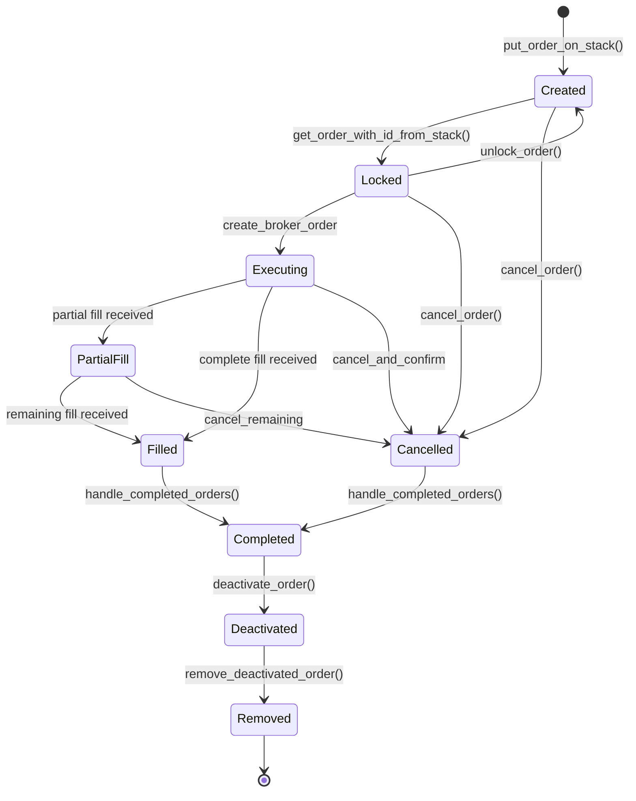
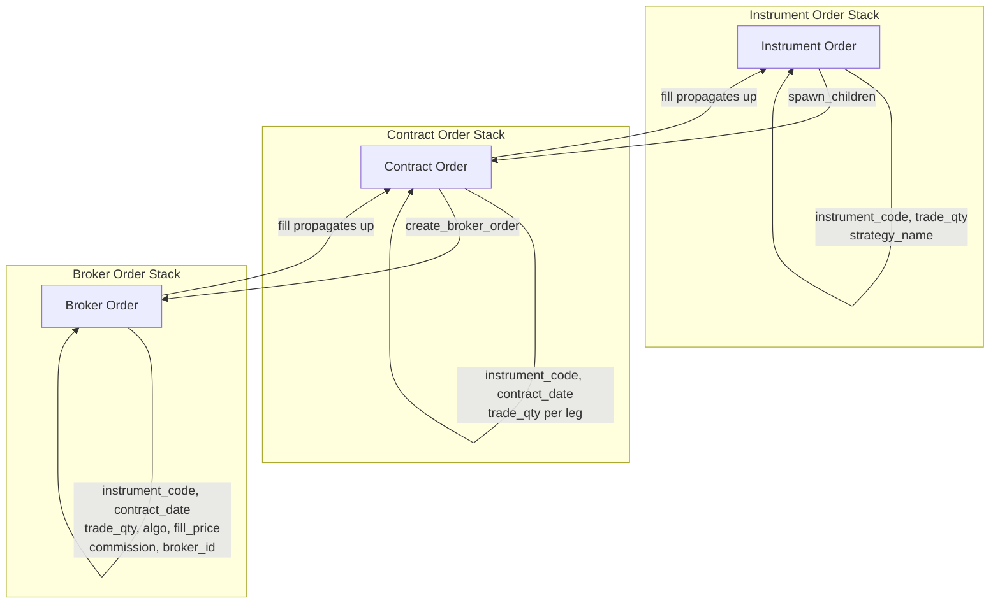
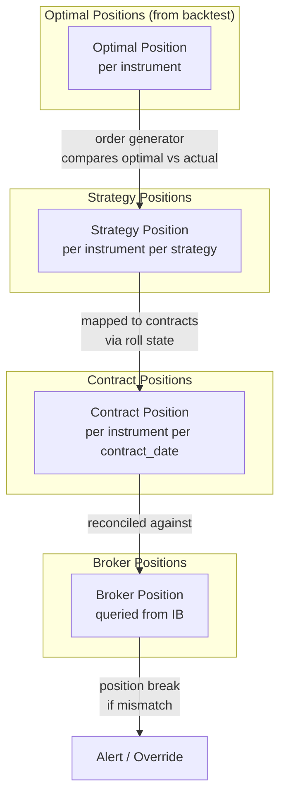
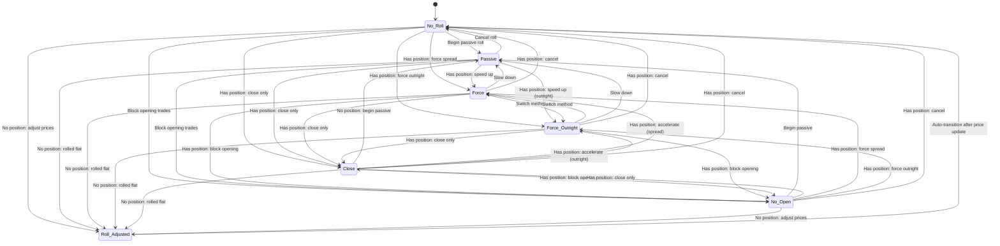
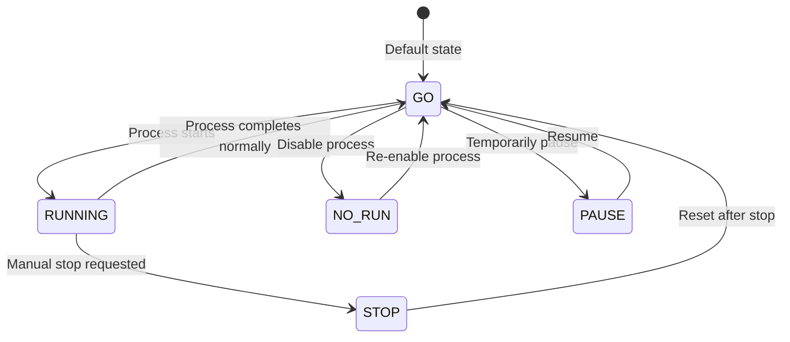
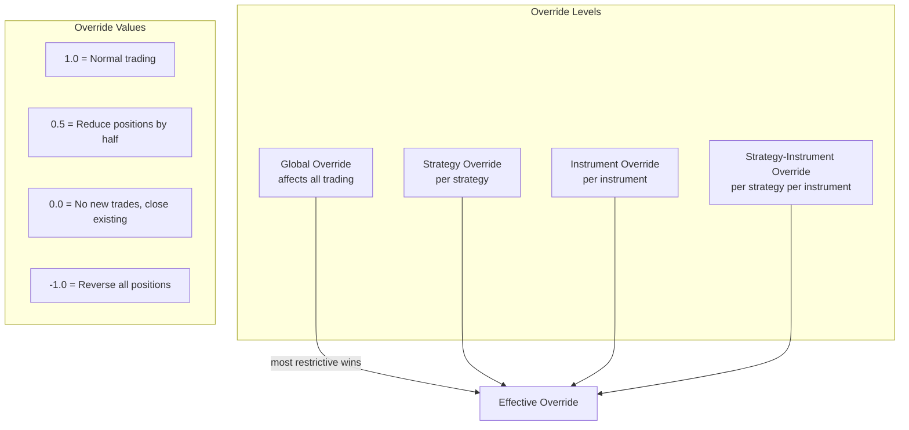

# State Management

## Order Stack State Machine

Orders flow through a three-layer stack system. Each order has a lifecycle managed by the `stackHandler`.

### Order Stack Layers

Each layer of the stack has a specific responsibility:

**Key behaviours:**
- An order is **locked** when it is being actively processed to prevent concurrent modification
- **Parent-child relationships** link orders across stacks: an instrument order spawns contract order children, which spawn broker order children
- Fills propagate upward: a broker fill updates the contract order, which updates the instrument order
- At end of day, `safe_stack_removal()` cancels unfilled broker orders, processes remaining fills, completes partial orders, and removes all deactivated orders

### Order Properties

Every order (base class `Order`) carries:

| Property | Type | Description |
|----------|------|-------------|
| `tradeable_object` | `tradeableObject` | What is being traded |
| `trade` | `tradeQuantity` | Desired trade quantity (can be multi-leg) |
| `fill` | `tradeQuantity` | Quantity filled so far |
| `filled_price` | `float` | Average fill price |
| `fill_datetime` | `datetime` | When the fill occurred |
| `locked` | `bool` | Whether the order is locked for processing |
| `order_id` | `int` | Stack-assigned ID |
| `parent` | `int` | Parent order ID in the layer above |
| `children` | `list[int]` | Child order IDs in the layer below |
| `active` | `bool` | False after fill/cancel completion |
| `order_type` | `orderType` | Market, limit, etc. |

## Position Tracking Lifecycle

Positions are tracked at multiple levels:

**Position reconciliation** runs as part of the stack handler cycle (`check_external_position_break`). If the contract-level position in the database does not match the broker-reported position, it flags a position break.

### Capital Tracking

Capital is tracked at three levels:

| Level | Description |
|-------|-------------|
| **Total capital** | Overall account value from broker (or manually updated) |
| **Maximum capital** | High-water mark for drawdown calculation |
| **Accumulated P&L** | Running profit/loss from trading |

Capital updates are run periodically (default every 120 seconds, max 10 times per day). Strategy-level capital allocation divides total capital among strategies.

## Contract Roll State Management

The roll state machine (defined in `src/sysobjects/production/roll_state.py`) controls how futures positions transition between contracts.

**Transition rules:**
- The allowed transitions depend on whether there is a current position in the priced contract (suffix `0` = no position, `1` = has position)
- `Roll_Adjusted` always transitions back to `No_Roll` automatically after adjusted prices are updated
- `Force` generates spread orders (buy forward, sell priced simultaneously)
- `Force_Outright` generates two separate outright orders
- `Passive` allows natural migration -- new trades go to forward, closing trades in priced
- `Close` only generates closing orders for the priced contract
- `No_Open` prevents new opening trades (used when approaching expiry but forward is not liquid enough)

## Process Control States

Each production process has a control status stored in MongoDB.

**Process statuses:**

| Status | Meaning |
|--------|---------|
| `GO` | Process is allowed to run |
| `NO-RUN` | Process is disabled and will not start |
| `STOP` | Process should stop at next check |
| `PAUSE` | Process is temporarily paused |

**Process lifecycle checks (in `processToRun._setup()`):**

1. Is the process marked as `NO-RUN`? If so, do not start.
2. Is it too early to run? (Check `process_configuration_start_time`)
3. Is a prerequisite process still running? (Check `process_configuration_previous_process`)
4. Is the process marked as `STOP`? If so, shut down.
5. Has the stop time been reached? (Check `process_configuration_stop_time`)

**Method-level control:**

Within each process, individual methods have their own scheduling:

| Parameter | Description |
|-----------|-------------|
| `frequency` | Minimum seconds between invocations (0 = run every cycle) |
| `max_executions` | Maximum times to run per day (-1 = unlimited) |

## Data Staleness Management

The system tracks when data was last updated to detect stale data conditions.

**FX and price data:**
- Each price update records the timestamp of the latest data point
- If prices have not been updated within the expected window (based on trading hours), the system flags the data as stale
- Stale data can trigger alerts via the email notification system (`src/syslogdiag/emailing.py`)

**Process monitoring:**
- `dictOfRunningMethods` tracks start and end times for each method within a process
- A method is considered "currently running" if its last start time is after its last end time
- The `monitor.py` module can check whether processes are running as expected

**Backtest state management:**
- Backtest results (optimal positions, account curves) are stored with timestamps
- `clean_truncate_backtest_states.py` removes old backtest states to save storage
- Each backtest run is identified by its timestamp, allowing comparison across runs

## Override System

Overrides provide manual control over trading at multiple granularity levels.

Overrides are stored in MongoDB (`mongo_override.py`, `mongo_temporary_override.py`) and checked during order generation. The most restrictive (lowest absolute value) override takes effect.

## Trade and Position Limits

Two complementary limit systems prevent excessive trading:

**Trade limits** (`src/sysobjects/production/trade_limits.py`):
- Maximum number of contracts tradeable per period (day, week, etc.)
- Tracked per instrument
- Prevents runaway trading from bugs or extreme signals

**Position limits** (`src/sysobjects/production/position_limits.py`):
- Maximum position size per instrument
- Can be set at strategy level or instrument level
- Prevents concentration risk

---
## See Also
- [README](README.md) — Project overview and quick start
- [Architecture](architecture.md) — System design and components
- [Workflow](workflow.md) — Event flows and processing pipelines
- [Development](development.md) — Development guide and best practices
