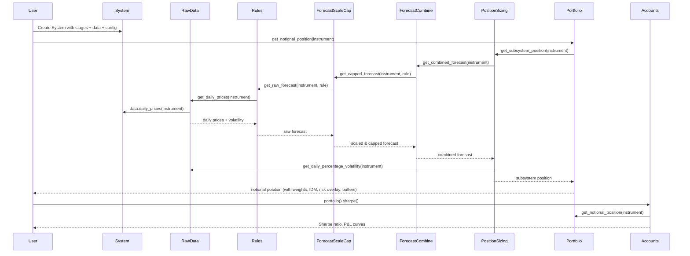
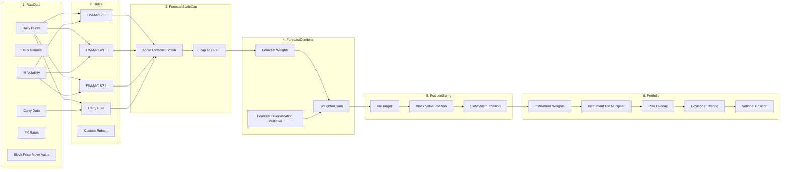
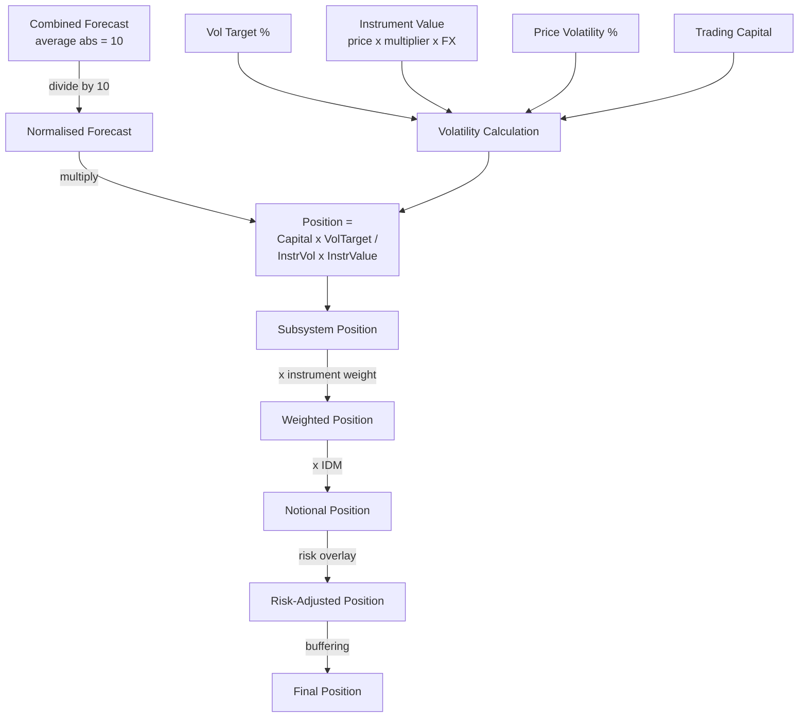
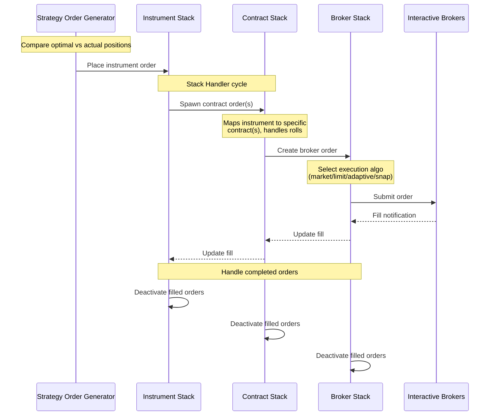
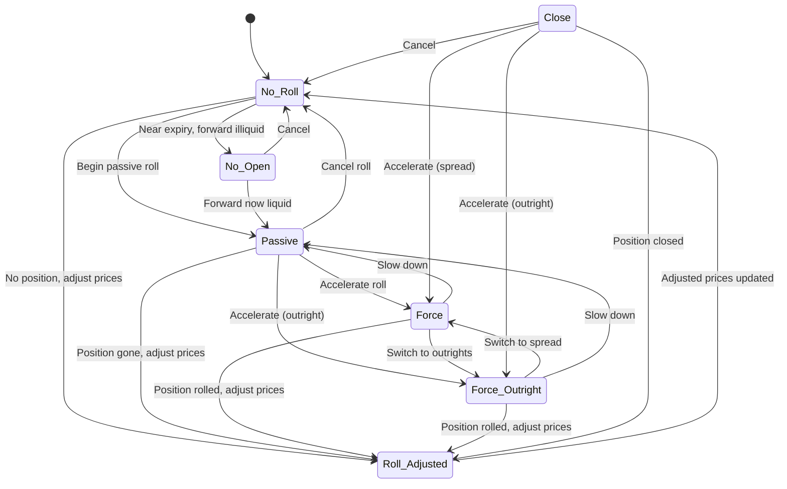
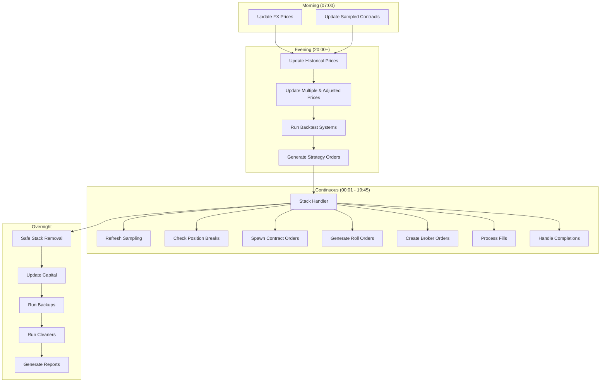
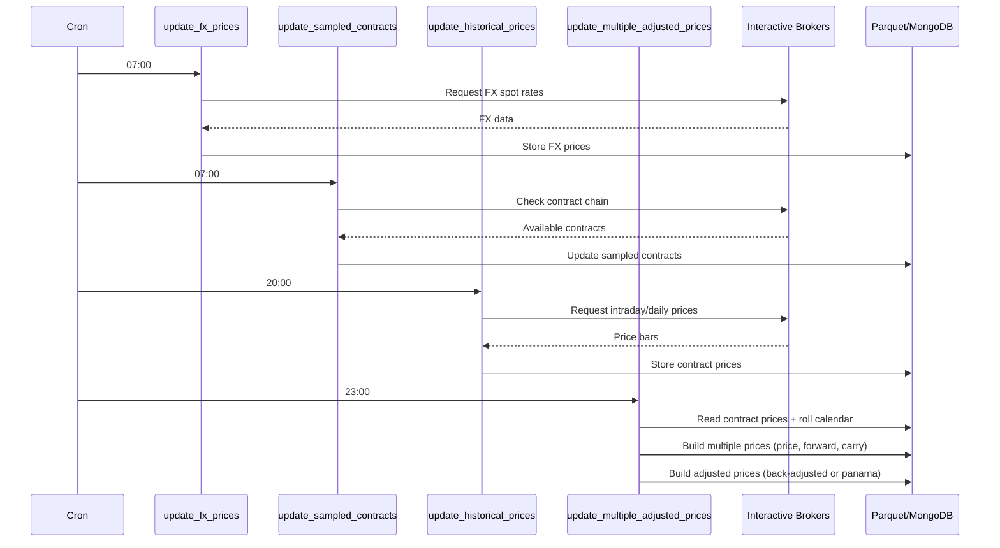

# Workflows

## Backtesting Pipeline

The backtesting system processes data through a chain of stages. Each stage caches its results using `@input`, `@diagnostic`, and `@output` decorators so calculations are only performed once.



## Stage Pipeline Detail



## Forecast Generation Pipeline

Each trading rule receives data inputs (typically price and optionally volatility or carry data) and produces a raw forecast. The system supports:

1. **Rule definition** -- `TradingRule` objects wrap a callable function, specify data inputs (e.g., `"data.daily_prices"`, `"rawdata.daily_annualised_roll"`), and pass named arguments (e.g., lookback periods).

2. **Rule variations** -- Multiple parameterisations of the same rule function (e.g., EWMAC with different fast/slow spans) are defined in config as `trading_rules`.

3. **Scaling** -- Raw forecasts are scaled so the average absolute value equals 10. Scalars can be fixed (from config) or estimated from data using pooled estimates.

4. **Capping** -- Scaled forecasts are capped at a configurable limit (default +/-20, or +/-2x the average).

5. **Combining** -- Forecasts are combined with diversification weights. The forecast diversification multiplier (FDM) accounts for less-than-perfect correlation between forecasts, ensuring the combined forecast also averages around 10 in absolute value.

## Position Sizing and Optimisation



**Key formula:**

```
Subsystem Position = (Capital * Vol_Target%) / (Instrument_Volatility% * Block_Value * FX_Rate) * (Forecast / 10)
```

Where:
- `Capital` is the total trading capital
- `Vol_Target%` is the annualised volatility target (e.g., 25%)
- `Instrument_Volatility%` is the annualised percentage price volatility
- `Block_Value` is the value of a 1-point price move per contract
- `FX_Rate` converts instrument currency to base currency
- `Forecast` is the combined forecast (scaled to average abs = 10)

## Order Generation and Execution



**Execution algorithms:**
- `algo_market.py` -- Simple market orders
- `algo_limit_orders.py` -- Limit orders at specified prices
- `algo_adaptive.py` -- Start with limit, fall back to market
- `algo_snaps.py` -- Snap-to-market orders
- `algo_original_best.py` -- Aggressive limit, then passive, then market

## Roll Management (Futures)

Futures contracts expire and must be rolled to maintain continuous positions. pysystemtrade manages this through a state machine.



**Roll states:**

| State | Description |
|-------|-------------|
| `No_Roll` | Normal trading. Only trades priced contract. |
| `Passive` | Allow natural roll -- closing trades in priced, opening in forward |
| `Force` | Force roll ASAP using spread order |
| `Force_Outright` | Force roll using two separate outright orders |
| `Roll_Adjusted` | Update adjusted price series (after position is flat) |
| `Close` | Close position in near contract only |
| `No_Open` | No new positions (near expiry, forward illiquid) |

## Daily Production Cycle



## Data Update Cycle



## P&L and Reporting

The reporting system generates multiple report types daily. Each report is produced by a dedicated module in `src/sysproduction/reporting/`.

**Report types:**
| Report | Module | Content |
|--------|--------|---------|
| P&L | `pandl_report.py` | Daily, MTD, YTD P&L by instrument and strategy |
| Risk | `risk_report.py` | Portfolio risk, correlation, VaR estimates |
| Costs | `costs_report.py` | Trading costs vs forecast costs |
| Slippage | `slippage_report.py` | Execution slippage analysis |
| Trades | `trades_report.py` | Recent trade details |
| Rolls | `roll_report.py` | Roll status and upcoming expiries |
| Reconciliation | `reconcile_report.py` | Position reconciliation vs broker |
| Status | `status_report.py` | Process and system health |
| Liquidity | `liquidity_report.py` | Market liquidity analysis |
| Strategies | `strategies_report.py` | Strategy-level performance |
| Instrument Risk | `instrument_risk_report.py` | Per-instrument risk metrics |
| Market Monitor | `market_monitor_report.py` | Real-time market overview |
| Minimum Capital | `minimum_capital_report.py` | Capital requirements analysis |
| Commissions | `commissions_report.py` | Commission tracking |
| Account Curve | `account_curve_report.py` | Equity curve analysis |

---
## See Also
- [README](README.md) — Project overview and quick start
- [Architecture](architecture.md) — System design and components
- [State Management](state-management.md) — State lifecycle and data models
- [Development](development.md) — Development guide and best practices
